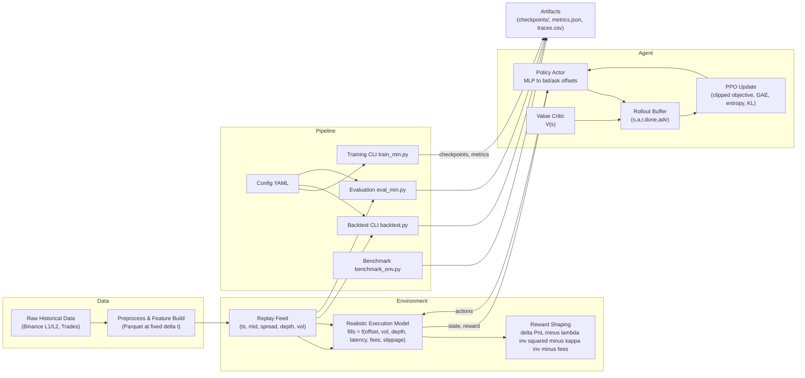

# RLMarketMaker

A reinforcement learning framework for algorithmic market making with realistic market simulation and historical data replay. This system implements a custom PPO agent that learns optimal bid/ask quoting strategies by interacting with a simulated market environment featuring adverse selection, execution latency, slippage, trading fees, volatility-aware fill probabilities, and inventory risk penalties. The PPO agent consistently outperforms baseline strategies (Avellaneda-Stoikov, Fixed Spread, Random) on both synthetic market data and historical replay from Polygon.

## Results

| Agent | PnL | Sharpe | Fill Rate | Inventory Var | Notes |
|-------|-----|--------|-----------|---------------|-------|
| **PPO (current)** | **1,563.53** | **1.56** | **90%** | **1,164.60** | Synthetic eval, λ=0.0015, H=50 |
| Avellaneda-Stoikov | ~500-5500 | 0.00-2.94 | 87.7% | 5,140.63 | Baseline (varies by config) |
| Fixed-Spread | negative to 4784 | — | 91.2% | 4,641.09 | Baseline (config-dependent) |
| Random | -90 to 826 | -0.31 to 3.18 | 80.3% | 6,255.38 | Baseline |

*Results are from `artifacts/eval_summary.csv` and evaluation reports. Numbers can be reproduced by running the evaluation scripts with the same configurations and seeds.*

## Architecture



## How to Run

### Installation

```bash
# Clone repository
git clone https://github.com/Alexander-Rees/RLMarketMaker.git
cd RLMarketMaker

# Create and activate virtual environment
make venv
source venv/bin/activate  # On Windows: venv\Scripts\activate

# Install dependencies (pinned versions in requirements.txt)
make install
# Or: pip install -r requirements.txt
```

**Requirements:**
- Python 3.8+
- See `requirements.txt` for pinned dependencies (PyTorch 2.1.1, Gymnasium 0.29.1, NumPy 1.24.3, Pandas 2.0.3)
- Tests pass with `make test` or `pytest tests/`

### Training

```bash
# Train PPO agent (using Makefile)
make train

# Or directly with Python
python scripts/training/train_min.py --config configs/ppo_optimized.yaml --seed 42

# Multi-seed training with optimized settings
python scripts/training/train_multi_seed.py --config configs/ppo_optimized.yaml --seeds 11 23 37
```

### Evaluation

```bash
# Evaluate trained model (using Makefile)
make eval

# Or directly
python scripts/evaluation/eval_min.py --checkpoint logs/checkpoints/policy --config configs/ppo_optimized.yaml --episodes 10 --seed 42

# Evaluate on historical replay data
python scripts/evaluation/evaluate_replay.py --config configs/polygon_replay.yaml --checkpoint logs/checkpoints/policy.pt --episodes 10
```

### Backtesting

```bash
# Run backtest with PPO agent
python scripts/backtest.py --agent ppo --ckpt logs/checkpoints/policy --config configs/ppo_optimized.yaml --steps 50000 --seed 123

# Run backtest with baseline strategies
python scripts/backtest.py --agent as --config configs/ppo_optimized.yaml --steps 50000 --seed 123
python scripts/backtest.py --agent fixed --config configs/ppo_optimized.yaml --steps 50000 --seed 123
python scripts/backtest.py --agent inv --config configs/ppo_optimized.yaml --steps 50000 --seed 123
python scripts/backtest.py --agent random --config configs/ppo_optimized.yaml --steps 50000 --seed 123
```

### Benchmarking

```bash
# Benchmark environment performance
python scripts/benchmark_env.py --steps 200000 --seed 42

# Custom config and output path
python scripts/benchmark_env.py --config configs/ppo_optimized.yaml --steps 500000 --output artifacts/benchmarks/my_benchmark.json
```

### Risk Parameter Sweep

```bash
# Run hyperparameter sweep for lambda and H values
python scripts/sweep_risk.py --config configs/ppo_improved.yaml --timesteps 400000
```

### Analysis and Visualization

```bash
# Generate agent behavior traces
python scripts/analysis/trace_eval.py --agent ppo --ckpt logs/checkpoints/policy.pt --steps 1000 --seed 123

# Create visualizations from traces
python scripts/analysis/plot_traces.py

# Generate equity curves and inventory plots
python scripts/generate_plots.py
```

## Realistic Market Dynamics

The environment implements the following realistic market features:

- **Adverse Selection**: Market moves against the agent when orders are filled (configurable `adverse_selection_eta`)
- **Latency**: Order execution delays simulate realistic network latency (`latency_ticks`)
- **Slippage**: Execution price adjustments based on market conditions (`slippage_coeff`)
- **Trading Fees**: Transaction costs reduce profitability (`transaction_fee`, `fee_bps`)
- **Volatility-Aware Fills**: Fill probabilities decrease during high volatility periods
- **Inventory Risk Penalties**: Quadratic and linear penalties for inventory imbalances (`lambda_inventory`, `kappa_inventory`)
- **Soft Position Limits**: Gradual penalties when exceeding inventory thresholds (`position_limit_threshold`)

**Historical Replay**: Supports Polygon.io historical market data for research and paper trading. Not intended for live trading.

## Reproducibility

All experiments are fully reproducible with consistent random seeds and configuration files:

- **Seeds**: Set via `--seed` argument (default: 42)
- **Configurations**: YAML files in `configs/` directory
  - `ppo_optimized.yaml`: Latest optimized PPO settings
  - `ppo_improved.yaml`: Alternative hyperparameters
  - `polygon_replay.yaml`: Historical replay configuration
- **Checkpoints**: Saved to `logs/checkpoints/` with model weights and normalization stats
  - Format: `policy.pt` (weights), `policy_vecnorm.pkl` (normalization)
- **Metrics**: 
  - Training logs: `logs/run_<timestamp>.csv`
  - Final metrics: `logs/checkpoints/metrics.json`
  - Evaluation summaries: `artifacts/eval_summary.csv`
- **Config Snapshots**: `logs/checkpoints/run_config.yaml` (saved during training)
- **Config Hash**: MD5 hash of config file stored in `metrics.json` for verification

**Smoke Tests**: Run `make test` or `pytest tests/` to verify environment and training pipeline.

## Visualizations

The project includes visualization tools for analyzing agent behavior:

- **Equity Curves**: `artifacts/plots/multi_seed_equity.png` - PnL over time for multiple training seeds
- **Inventory Management**: `artifacts/plots/inventory.png` - Inventory distribution and time series
- **Price & Quotes**: `artifacts/plots/price_quotes.png` - Midprice with agent quotes and fill markers
- **Trace Analysis**: Per-timestep behavior traces in `artifacts/traces/*.csv`

## Project Structure

```
RLMarketMaker/
├── rlmarketmaker/           # Core package
│   ├── agents/              # RL agents and baselines
│   │   ├── min_ppo.py      # Custom PPO implementation
│   │   └── baselines.py    # Baseline strategies (AS, Fixed, Random, Inv)
│   ├── data/               # Data feeds and preprocessing
│   │   ├── feeds.py        # Market data feeds (Synthetic, Polygon)
│   │   └── preprocess_polygon.py  # Historical data preprocessing
│   ├── env/                # Market environments
│   │   ├── realistic_market_env.py  # Realistic simulation
│   │   ├── replay_market_env.py     # Historical replay
│   │   ├── fill_models.py           # Order fill models
│   │   ├── enhanced_reward.py       # Reward functions
│   │   └── reward.py               # Base reward calculator
│   └── utils/              # Utilities
│       ├── config.py       # Configuration loading
│       ├── metrics.py      # Performance metrics
│       ├── logging.py      # Logging utilities
│       └── io.py          # I/O helpers (JSON, CSV)
├── scripts/                # Executable scripts
│   ├── training/           # Training scripts
│   │   ├── train_min.py   # Main PPO training
│   │   └── train_multi_seed.py  # Multi-seed training
│   ├── evaluation/         # Evaluation scripts
│   │   ├── eval_min.py    # Main evaluation
│   │   ├── evaluate_replay.py  # Historical replay eval
│   │   └── evaluate_realistic.py  # Realistic env eval
│   ├── analysis/           # Analysis and visualization
│   │   ├── trace_eval.py  # Generate behavior traces
│   │   └── plot_traces.py  # Visualize traces
│   ├── backtest.py        # Backtest CLI wrapper
│   ├── benchmark_env.py   # Environment performance benchmark
│   └── sweep_risk.py      # Risk parameter sweep
├── configs/                # Configuration files
│   ├── ppo_optimized.yaml  # Optimized PPO hyperparameters
│   ├── ppo_improved.yaml   # Alternative PPO config
│   ├── polygon_replay.yaml # Historical replay config
│   └── realistic_environment.yaml  # Realistic market config
├── data/                   # Data storage
│   ├── polygon/            # Historical market data
│   └── replay/             # Processed replay data
├── logs/                   # Training logs and results
│   └── checkpoints/        # Model checkpoints and metrics
├── artifacts/              # Analysis outputs
│   ├── traces/             # Agent behavior traces
│   ├── plots/              # Visualization plots
│   ├── benchmarks/         # Performance benchmarks
│   └── backtests/          # Backtest results
├── notebooks/              # Jupyter notebooks
│   ├── agent_analysis.ipynb       # Agent behavior analysis
│   └── visualize_traces.ipynb     # Trace visualization
└── tests/                  # Test suite
    ├── test_env_core.py    # Environment tests
    ├── test_latency.py     # Latency tests
    ├── test_reward.py      # Reward tests
    └── test_min_trainer.py  # PPO trainer tests
```

## Roadmap

- **Extended Training**: Run longer training (500k-1M steps) to improve Sharpe ratio from 1.56 to target ≥2.0
- **Entropy Fine-Tuning**: Adjust entropy coefficient schedule (0.006 → 0.004) for more consistent policy
- **Evaluation Expansion**: Increase evaluation episodes (10 → 20) for more robust metrics
- **Metrics Tracking**: Add comprehensive training metrics dashboard (TensorBoard or custom)
- **Microservice Architecture**: Optional split into Market Data service and Policy service for production deployment

## License

This project is licensed under the MIT License.

## Acknowledgments

- Built on Gymnasium for environment interface
- Uses PyTorch for neural network implementation
- Historical data provided by Polygon.io
- Inspired by Avellaneda-Stoikov optimal market making theory
